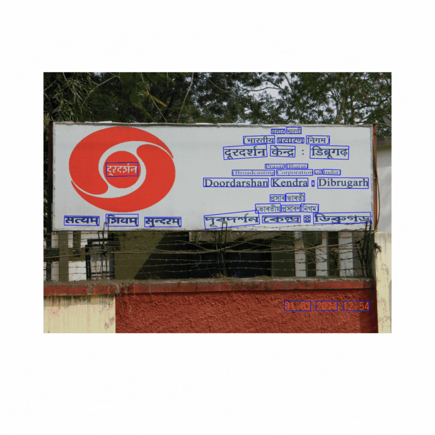

<p align="center">
  
  <h3 align="center">
 BharatOCR - Comprehensive Scene Text Recognition Toolkit </br> across 13 Indian Languages
  </h3>
</p>
<hr style="width: 100%; border: 1px solid #000;">

BharatOCR is an advanced OCR toolkit designed for detecting, identifying, and recognizing text across 13 Indian languages, including Assamese, Bengali, Gujarati, Hindi, Kannada, Malayalam, Marathi, Meitei Odia, Punjabi, Tamil, Telugu, Urdu, and English. Built to handle the unique scripts and complex structures of Indian languages, BharatOCR provides robust detection and recognition capabilities, making it a valuable tool for processing multilingual documents and enhancing document analysis in these diverse scripts.


<hr style="width: 100%; border: 1px solid #000;">

<hr style="width: 100%; border: 1px solid #000;">

## Table of Content
<li>[Updates](https://github.com/Bhashini-IITJ/BharatOCR/blob/main/README.md#updates)</li>
<li>[Installation](https://github.com/Bhashini-IITJ/BharatOCR/blob/main/README.md#installation)</li>
<li>[How to use](https://github.com/Bhashini-IITJ/BharatOCR/blob/main/README.md#installation)</li>
<li>[Acknowledgments](https://github.com/Bhashini-IITJ/BharatOCR/blob/main/README.md#installation)</li>
<li>[Contact us](https://github.com/Bhashini-IITJ/BharatOCR/blob/main/README.md#installation)</li>

<hr style="width: 100%; border: 1px solid #000;">


## Updates
<b>[October 2024]:</b> Private repository created. 
<hr style="width: 100%; border: 1px solid #000;">

## Installation
Currently we need to manually create virtual environemnt.
```python
conda create -n bharatocr python=3.9 -y
conda activate bharatocr


git clone https://github.com/Bhashini-IITJ/BharatOCR.git
cd BharatOCR

pip install pip-tools
make clean-reqs reqs  # Regenerate all the requirements files
# Use specific platform build. Other PyTorch 2.0 options: cu118, cu121, rocm5.7
platform=cu118
# Generate requirements files for specified PyTorch platform
make torch-${platform}
# Install the project and core + train + test dependencies. Subsets: [train,test,bench,tune]
pip install -r requirements/core.${platform}.txt -e .[train,test]
pip install opencv-python==4.10.0.84
pip install shapely==2.0.6
pip install openai-clip==1.0.1
pip install lmdb==1.5.1

python setup.py sdist bdist_wheel
pip install dist/bharatOCR-1.0.0-py3-none-any.whl
```

## Config
Currently this model works for hindi v/s english script identification and thereby hindi and english recognition.

Detection Model: EAST\
ScripIndetification Model: Hindi v/s English\
Recognition Model: Hindi, English 

## How to use
### Detection

```python
from bharatOCR.ocr import OCR

# Create an object of OCR
ocr_system = OCR()

# Get detections
ocr_system.detect("demo_images/image_141.jpg")
# Running text detection...
# 4334 text boxes before nms
# 0.9630489349365234
# [[[1137, 615], [1333, 615], [1333, 753], [1137, 752]], [[642, 644], [1040, 645], [1039, 753], [642, 752]], [[647, 833], [1034, 834], [1034, 945], [646, 944]], [[1567, 709], [1720, 709], [1720, 777], [1567, 777]], [[1412, 826], [1567, 826], [1566, 886], [1412, 886]], [[305, 800], [453, 800], [453, 855], [305, 854]], [[1419, 686], [1549, 686], [1549, 770], [1419, 770]], [[1124, 843], [1336, 844], [1336, 949], [1124, 948]], [[1571, 831], [1729, 831], [1729, 891], [1571, 891]], [[196, 796], [301, 796], [301, 861], [196, 860]], [[211, 677], [336, 677], [336, 747], [211, 747]], [[350, 679], [447, 679], [447, 749], [350, 749]]]
```


```
# Get recognitions
ocr_system.recognise("demo_images/cropped_image/image_141_0.jpg", "hindi")
# Recognizing text in detected area...
# 'मण्डी'

# Complete pipeline
results=ocr_system.ocr("demo_images/image_141.jpg")
# Running text detection...
# 4334 text boxes before nms
# 0.9715704917907715
# Identifying script for the cropped area...
# Recognizing text in detected area...
# Recognized word: रोड
# Identifying script for the cropped area...
# Recognizing text in detected area...
# Recognized word: बाराखम्ब
# Identifying script for the cropped area...
# Recognizing text in detected area...
# Using cache found in /DATA1/ocrteam/.cache/torch/hub/baudm_parseq_main
# Recognized word: barakhaml
# Identifying script for the cropped area...
# Recognizing text in detected area...
# Recognized word: हाऊस
# Identifying script for the cropped area...
# Recognizing text in detected area...
# Using cache found in /DATA1/ocrteam/.cache/torch/hub/baudm_parseq_main
# Recognized word: mandi
# Identifying script for the cropped area...
# Recognizing text in detected area...
# Using cache found in /DATA1/ocrteam/.cache/torch/hub/baudm_parseq_main
# Recognized word: chowk
# Identifying script for the cropped area...
# Recognizing text in detected area...
# Recognized word: मण्डी
# Identifying script for the cropped area...
# Recognizing text in detected area...
# Using cache found in /DATA1/ocrteam/.cache/torch/hub/baudm_parseq_main
# Recognized word: road
# Identifying script for the cropped area...
# Recognizing text in detected area...
# Using cache found in /DATA1/ocrteam/.cache/torch/hub/baudm_parseq_main
# Recognized word: house
# Identifying script for the cropped area...
# Recognizing text in detected area...
# Using cache found in /DATA1/ocrteam/.cache/torch/hub/baudm_parseq_main
# Recognized word: rajiv
# Identifying script for the cropped area...
# Recognizing text in detected area...
# Recognized word: राजीव
# Identifying script for the cropped area...
# Recognizing text in detected area...
# Recognized word: चौक


```

<!-- ## Training -->

## Acknowledgement 

Text Recognition - [PARseq](https://github.com/baudm/parseq)\
EAST re-implemenation [repository](https://github.com/foamliu/EAST).
[Bhashini](https://bhashini.gov.in/)
## Contact us
For any queries, please contact us at:
- [Anik De](mailto:anekde@gmail.com)

